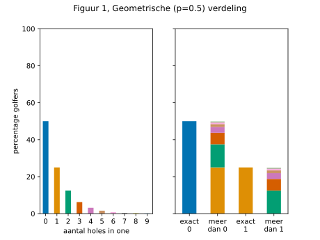
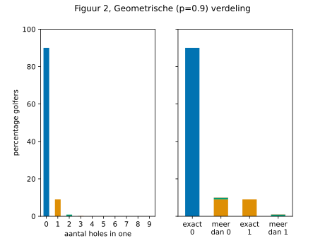
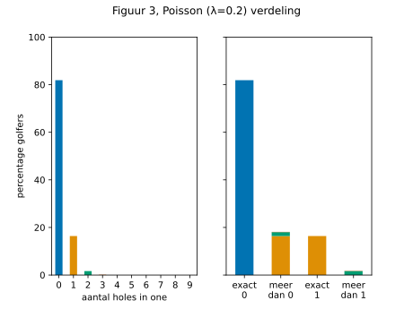
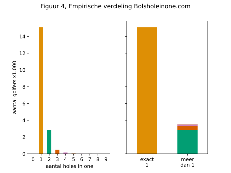

## "Als iemand tenminste één hole in one heeft gemaakt, dan is de kans groter dat hij er meer dan één heeft, dan exact één." Waar of niet waar?

Op 6 augustus jongstleden sloeg 'The Green Machine' een hole in one (ace) en onder het genot van een glas champagne poneerde zijn flightgenoot bovenstaande interessante stelling die ik ben gaan toetsen.

Hoe groot zijn de groepen met een bepaald aantal aces? We kunnen een eerste grove inschatting maken door aan te nemen dat de groepsgrootte met een constante factor kleiner wordt naarmate het aantal aces toeneemt. Stel, bij elke extra ace neemt de groepsgrootte met 50% af, dan zouden we de geometrische verdeling krijgen in Figuur 1. Bij een afname van 50% per ace is de stelling op het randje van waar/niet waar: de groepen met exact één en meer dan één ace zijn even groot. Echter, ook de groepen met nul en meer dan nul aces zijn even groot. Dat lijkt niet realistisch, want (ruim) minder dan 50% van de golfers zal tenminste één ace hebben geslagen. Dat impliceert een grotere afname dan 50% per groep. Figuur 2 laat de verdeling zien waarbij slechts 10% een ace heeft geslagen en de groepsgrootte met 90% per extra ace afneemt. In dat geval is de groep met exact één ace groter dan met meer dan één ace: stelling onjuist.

Een Poisson verdeling geeft de kans op een bepaald aantal gebeurtenissen in een tijdsinterval waarbij het optreden van de volgende gebeurtenis onafhankelijk is van de vorige. Figuur 3 geeft de Poisson (λ=0.2) verdeling voor iemand die 25 rondjes (met vier par-3's) per jaar speelt gedurende 20 jaar, met een kans van 1 op 10.000 op een ace per par-3; stelling onjuist. De verdeling voor de complete golfpopulatie is een combinatie van Poisson verdelingen met verschillende parameters, omdat niet iedereen even vaak speelt en de kans op een ace per hole per speler varieert. Een grote groep golfers zal minder vaak spelen en daarmee de stelling nog minder waarschijnlijk maken.

Wat laat empirische data zien? Ik heb de Bols hole in one website gescraped; die bevat 23.283 aces vanaf 1930. Figuur 4 laat zien dat ook hier de stelling onjuist is.

De Bols dataset is niet compleet. Mensen kunnen er zelf voor kiezen om hun ace te registreren en doen dat misschien slechts eenmalig; bij eventuele volgende aces is de nieuwigheid er af. Anderzijds, als mensen hun eerste niet registreren, zullen ze het daarna waarschijnlijk ook niet doen. Alle groepen zullen in werkelijkheid groter zijn. Over hoe de groepsgrootteverhoudingen veranderen kan men twisten.

De kans op een ace per slag zal enigszins afhankelijk zijn van handicap. Bij meer pogingen zal de kans op één en meerdere aces toenemen. De stelling zou waar kunnen zijn voor een subset van alle golfers, bijvoorbeeld professionals. Ook 'The Green Machine' en de flightgenoot hebben een lage handicap, spelen regelmatig en hebben elk drie aces gemaakt. Echter, het overgrote deel van de complete golfpopulatie speelt niet vaak en heeft ook geen lage handicap waardoor de kans op één ace, laat staan meerdere, klein is. Door die grote groep denk ik dat de stelling voor alle golfers tezamen onjuist is; en voor een willekeurige individuele speler vaker onjuist dan juist.
